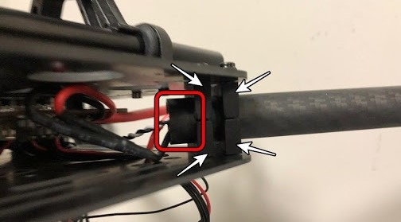
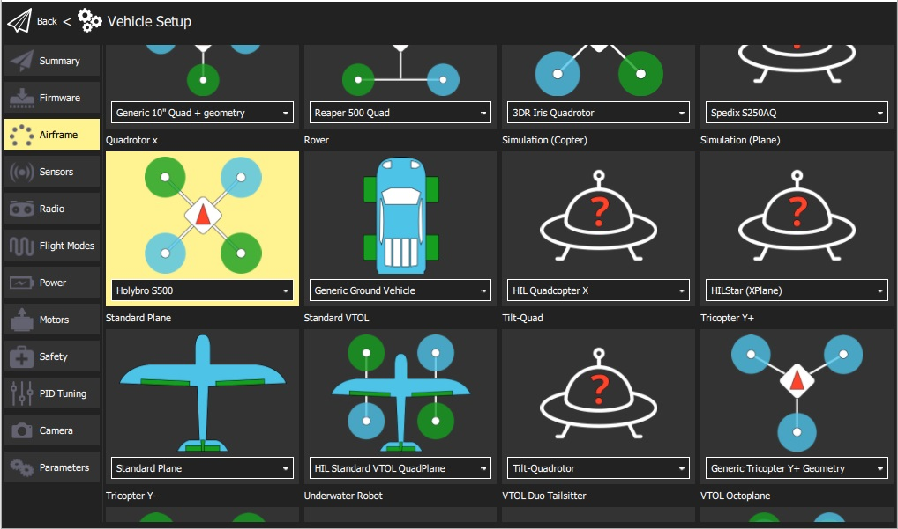

# Holybro X500 + Pixhawk4 조립

키트 조립법과 *QGroundControl*의 PX4 설정법을 설명합니다.

## 주요 정보

- **프레임:** Holybro X500
- **비행 컨트롤러:** [Pixhawk 4](../flight_controller/pixhawk4.md)
- **조립 시간 (예상):** 2시간 (프레임 조립에 75분, 오토파일럿 설치 및 설정에 45분)

## 부품 명세서

Holybro [X500 키드](https://shop.holybro.com/x500-kit_p1180.html)에는 필수 구성 요소가 포함되어 있습니다.

* [Pixhawk 4 autopilot](../flight_controller/pixhawk4.md)
* Pixhawk 4 GPS
* 배터리 스트랩
* 프로펠러 - 1045
* 모터 - 2216 KV880
* 전원 및 무선 조종기 케이블
* 전원 관리 - PM07
* Wheelbase - 500 mm
* 치수 - 410 *410* 300mm
* 433 MHz Telemetry Radio/915 MHz Telemetry Radio

또한 배터리와 수신기([호환 무선 조종기](../getting_started/rc_transmitter_receiver.md))가 필요합니다. 이 조립 예제에서는 다음의 부품들을 사용합니다.

* 수신기: FR SKY Taranis
* 배터리: [4S 1300 mAh](http://www.getfpv.com/lumenier-1300mah-4s-60c-lipo-battery-xt60.html)

## 하드웨어

프레임과 자율비행프로그램 설치를 위한 하드웨어들 입니다.

| 항목              | 설명                           | 수량 |
| --------------- | ---------------------------- | -- |
| 소켓 캡 나사         | 모터 고정에 사용, 스테인레스 스틸 나사 M3*5  | 16 |
| 탄소 섬유 튜브-암      | 직경 : 16mm, 길이 : 200mm        | 4  |
| 모터 베이스          | 6 개의 부품과 4 개의 나사로 구성 4 개의 너트 | 4  |
| 슬라이드 바          | 직경 : 10mm, 길이 : 250mm        | 2  |
| 배터리 장착 보드       | 두께: 2mm                      | 1  |
| 배터리 패드          | 3mm 실리콘 시트 검정                | 1  |
| 철탑              | 구리 너트가 내장된 엔지니어링 플라스틱        | 2  |
| 십자 접시 머리 나사     | 스테인리스  M2.5*5mm              | 12 |
| PAN/TILT 플랫폼 보드 | 두께: 2mm                      | 1  |
| 행거 고무링 개스킷      | 내부 구멍 직경 : 10mm 검정           | 8  |
| 헹거              | 구리 너트가 내장된 엔지니어링 플라스틱        | 8  |
| 탄소 섬유 - 바닥 판    | 두께 2mm                       | 1  |
| 소켓 캡 나사         | 스테인리스  M2.5*6mm              | 8  |
| 나일론 스터드         | 검정 M3*6+6                    | 4  |
| 나일론 나사          | 검정 M3*6                      | 4  |
| 탄소 섬유 - 상판      | 두께: 1.6mm                    | 1  |
| 냄비 머리 나사        | 금속 검정 M3*30mm                | 16 |
| 나일론 스트랩         | 16mm 탄소 섬유 튜브의 U 자형          | 16 |
| 나일론 너트          | 검정 M3                        | 4  |
| Locknut         | 금속 검정 M3                     | 16 |
| 소켓 캡 나사         | 금속 검정 M3*8mm                 | 8  |
| 착륙 기어 - 수직 막대   | 탄소 섬유 튜브 + 엔지니어링 플라스틱 + 패스너  | 2  |
| 착륙 기어 - 크로스바    | 탄소 섬유 튜브와 여러 부품으로 구성         | 2  |

## 패키지

| 항목                  | 패키지 |
| ------------------- | --- |
| Pixhawk 4           | 1   |
| Pixhawk4 GPS 모듈     | 1   |
| I2C 스플리터 보드         | 2   |
| 6 ~ 6 핀 케이블 (전원)    | 3   |
| 4 ~ 4 핀 케이블 (CAN)   | 2   |
| 6 ~ 4 핀 케이블 (데이터)   | 1   |
| 10 ~ 10 핀 케이블 (PWN) | 2   |
| 8 ~ 8 핀 케이블 (AUX)   | 1   |
| 7 ~ 7 핀 케이블 (SPI)   | 1   |
| 6 ~ 6 핀 케이블 (디버깅)   | 1   |
| PPM/SBUS 출력 케이블     | 1   |
| XSR 수신기 케이블         | 1   |
| DSMX 수신기 케이블        | 1   |
| SBUS 수신기 케이블        | 1   |
| USB 케이블             | 1   |
| 'X'타입 접이식 받침대 마운트   | 1   |
| 70mm 및 140mm 카본 받침대 | 2   |
| 6*3 2.54mm 피치 수평 핀  | 1   |
| 8*3 2.54mm 피치 수평 핀  | 2   |
| 폼 세트                | 1   |
| Pixhawk 4 빠른 시작 가이드 | 1   |
| Pixhawk4 핀아웃        | 1   |
| GPS 빠른 시작 가이드       | 1   |

### 전자부품

| 항목 설명                                           | 수량 |
| ----------------------------------------------- | -- |
| Pixhawk 4 autopilot（PM06 not included)          | 1  |
| 전원 관리 PM02 (조립)                                 | 1  |
| 모토 - 2216 KV880（V2 Update)                      | 4  |
| Pixhawk 4 GPS                                   | 1  |
| 조립된 ESC 전원 관리 보드                                | 1  |
| 433MHz Telemetry Radio / 915MHz Telemetry Radio | 1  |

### 필요 공구

조립시에 필요한 공구들입니다.

- 1.5 mm 육각 스크류드라이버
- 2.0 mm 육각 스크류드라이버
- 2.5 mm 육각 스크류드라이버
- 3mm Phillips 스크류드라이버
- 전선 커터
- 정밀 트위저

## 조립

조립 예상 시간은 120 분, 프레임 조립의 경우 약 75 분, QGroundControl에서 자동조종장치 설정에 45 분입니다.

**1 단계 :** 먼저 착륙 기어를 수직 기둥에 조립합니다. 랜딩 기어 나사를 풀고 수직 기둥을 삽입합니다 (그림 1 및 2 참조).

(그림 1)

(그림 2)

**2 단계 :** 그림 3과 같이 4 개의 U 자형 나일론 스트랩을 사용하여 홀더를 탄소 섬유 암에 부착하여 모터 홀더를 장착합니다.

(그림 3)

**3 단계 :** 그림 4 및 5와 같이 전원 관리 PM02를 하단 플레이트에 부착합니다.

(그림 4)

(그림 5)

**4 단계 :** 하부 플레이트를 랜딩 기어에 조립합니다. 수직 기둥이 있는 랜딩 기어를 바닥 판에 나사로 고정합니다.

하단 플레이트에는 4 개의 구멍이 있습니다 (그림 4 화살표 참조). M3X8 나사를 사용하여 총 8 개, 각 측면에 4 개씩.

(그림 6)

**5 단계 :** 배터리 마운트를 프레임에 조립합니다. 이를 위해 M2 5X6 나사와 배터리 마운트가 필요합니다 (그림 7 참조).

(그림 7)

긴 막대를 작은 링에 삽입합니다 (그림 8 및 9 참조).

(그림 8)

(그림 9)

배터리 홀더가 장착 된 상태에서 그림 10과 같이 이미지에 표시된 화살표 위치에 나사를 조입니다. GPS 모듈이 전방을 향하도록 설치하여야  합니다.

(그림 10)

**6 단계 :** 8 * 3 2.54mm 피치 수평 핀을 전원 관리 보드의 10 ~ 10 핀 케이블 (PWM)에 조립합니다. 10 ~ 10 핀 케이블 (PWM)을 8 * 3 2.54mm 피치 수평 핀에 연결합니다 (그림 11 참조).

(그림 11)

3M 테이프 조각을 잘라 수평 핀 하단에 부착합니다 (그림 12 참조) 수평 핀을 전원 관리 보드에 부착 (그림 13 참조).

(그림 12)

(그림 13)

**7 단계 :** 차량 암을 본체에 설치합니다. ESC를 그림 14와 같이 Arm 튜브에 밀어 넣고, 그림 15와 같이 ESC 케이블을 다시 밀어 넣을 것이기 때문에 ESC 케이블이 너무 길지 않은지 확인합니다.

(그림 14)

(그림 15)

**8 단계 :** 암을 본체에 조립합니다.

4 개의 U 자형 나일론 스트랩을 더 사용하여 그림 16과 같이 모터가 설치된 암을 차량 본체에 부착합니다. 이렇게 하면 하단 플레이트도 상단 플레이트에 부착됩니다.

암 튜브를 약간 밀어 넣어 그림 16의 붉은 광장에 표시된 것처럼 제자리에 단단히 고정되도록하십시오.

(그림 16)

**9 단계 :** 모터 케이블을 연결합니다.

4 개의 암이 본체에 장착 된 후 케이블 (빨간색, 파란색, 검은 색)을 연결하고 암 튜브에 밀어 넣습니다 (그림 17 참조).

색상으로 구분된 3 개의 케이블이 ESC에 연결됩니다.

(그림 17)

**10 단계 :** 프레임에 GPS 장착. 이를 위해서는 Pixhawk 4 GPS와 마운팅 플레이트가 필요합니다.

GPS 마스트를 플레이트에 장착하고, 4 개의 나사를 사용하여 그림 18의 빨간색 원을 참조하고, 플레이트가 그림 18의 화살표로 표시된대로 배터리 홀더 튜브에 장착된다는 점을 유의하십시오.

(그림 18)

테이프를 사용하고 GPS를 GPS 마스트 상단에 붙입니다 (그림 19 참조).

(그림 19)

**11 단계 :** Pixhawk 4 배선. Pixhawk 4의 배선 방법은 몇 가지가 다릅니다. 아래에는 Pixhawk에 필요한 모든 전선과 연결시의 모습이 기술되어 있습니다.

플러그인 원격 측정 및 GPS 모듈을 비행 컨트롤러에 연결합니다 (그림 20 참조). RC 수신기, 4 개의 ESC 모두를 비행 컨트롤러와 전원 모듈에 연결합니다 (그림 21 참조).

(그림 20)

(그림 21)

(완전 조립된 X500 키트)

## PX4 설치 및 설정

*QGroundControl*에서 PX4 자율비행 프로그램을 설치하고 QAV250 프레임 설정과 보정 작업을 진행합니다. *QGroundControl*을 [다운로드 후에 설치](http://qgroundcontrol.com/downloads/) 하십시오.

:::tip PX4 설치 및 설정 매뉴얼은 [기본 설정](../config/README.md)편을 참고하십시오.
:::

먼저, 펌웨어와 기체프레임을 업데이트 합니다.
* [펌웨어](../config/firmware.md)
* [기체](../config/airframe.md)

:::note
*Holybro S500* 기체 (**Quadrotor x > Holybro S500**)를 선택하여야 합니다.
:::

다음에는 필수작업인 설정작업과 보정 작업을 진행합니다.
* [센서 방향](../config/flight_controller_orientation.md)
* [나침반](../config/compass.md)
* [가속도계](../config/accelerometer.md)
* [수평 보정](../config/level_horizon_calibration.md)
* [무선 조종기 설정](../config/radio.md)
* [비행 모드](../config/flight_mode.md)

다음 작업들은 반드시 진행하여야 합니다.
* [ESC 보정](../advanced_config/esc_calibration.md)
* [배터리](../config/battery.md)
* [안전 설정](../config/safety.md)

## 튜닝

기체 선택은 프레임의 자유비행 관련 *기본*적인 매개 변수를 설정합니다. 이 상태로도 비행이 가능하지만, 특정 기체에 관련된 변수들을 조정하는 것이 바람직합니다.

튜닝 정보는 [멀티 콥터 PID 튜닝 가이드](../config_mc/pid_tuning_guide_multicopter.md)를 참조하십시오.

## 감사의 글

이 조립 방법은 Dronecode Test Flight Team에서 제공했습니다.
